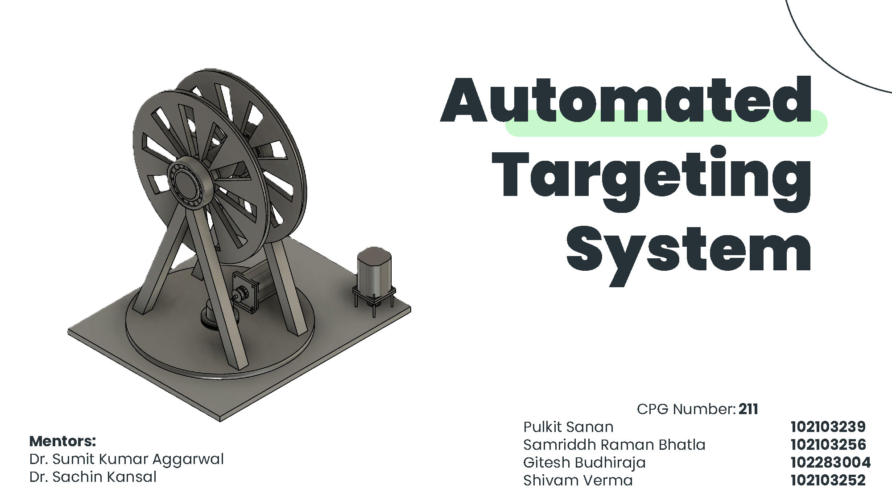
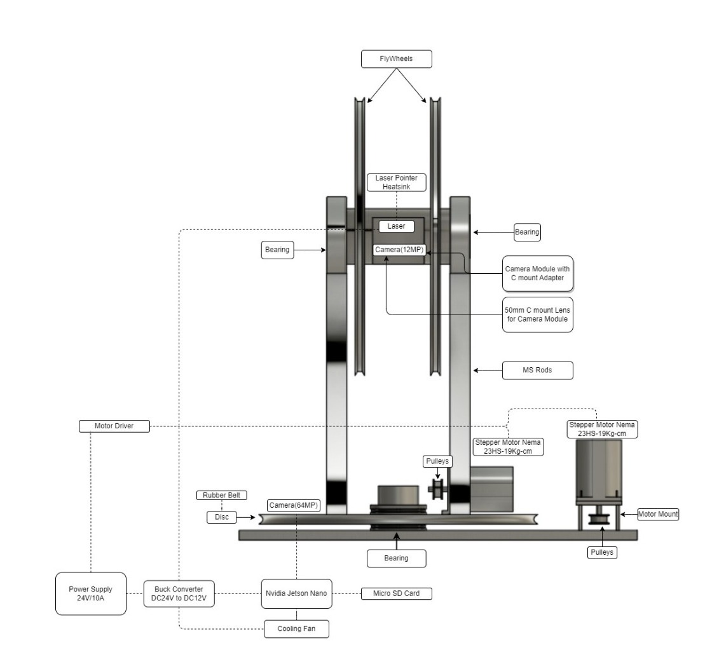
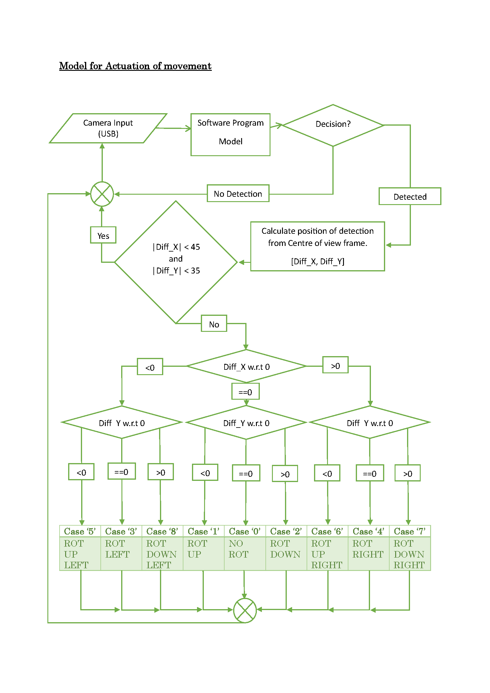
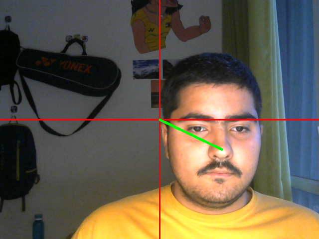

# Automated Targeting System

### Mentors

- Dr. Sumit Kumar Aggarwal
- Dr. Sachin Kansal

## Table of Contents

- [Project Overview](#project-overview)
- [Need Analysis](#need-analysis)
- [Problem Statement & Objectives](#problem-statement--objectives)
- [Assumptions & Constraints](#assumptions--constraints)
- [Project Execution Plan / Methodology](#project-execution-plan--methodology)
- [Mechanical Assembly](#mechanical-assembly)
- [Requirements](#requirements)
  - [Mechanical Components](#mechanical-components)
  - [Electronics Components](#electronics-components)
  - [Miscellaneous Components](#miscellaneous-components)
- [Connection Diagram](#connection-diagram)
- [Software Setup](#software-setup)
- [Usage](#usage)

## Project Overview

The Automated Targeting System (ATS) is an innovative solution that autonomously detects, tracks, and targets subjects with precision, redefining security and defense operations. It integrates advanced sensor and imaging technologies with real-time detection and monitoring algorithms, optimizing control and movement mechanisms to ensure precise and reliable targeting. The ATS aims to address the inefficiencies and complexities of conventional targeting techniques, providing a robust and adaptable solution suitable for various security and defense applications.

## Need Analysis

- Conventional techniques are inefficient and result in heavy collateral damage in armed conflicts.
- Security threats are becoming increasingly complex and varied.
- There is a lack of successful indigenous deterrent systems.
- Improving targeting is essential to optimize operational effectiveness.
- A mentor visit to the Army General Cantonment in Jalandhar identified the problem, as highlighted by Army personnel.

## Problem Statement & Objectives

**Problem Statement:**
To develop a targeting system that is:
- Autonomous
- Precise
- Adaptable
- Reliable & Robust

**Objectives:**
- Develop an Automated Targeting System (ATS) prototype.
- Integrate sensor and imaging technologies.
- Implement real-time detection and monitoring algorithms.
- Optimize control and movement mechanisms.
- Produce detailed testing and validation reports.

## Assumptions & Constraints

**Assumptions:**
- The mechanical assembly is static.
- Single target detection.
- The target is assumed to be 5m-50m away.

**Constraints:**
- Open-loop system.
- Movement precision at the cost of other parameters.

## Project Execution Plan / Methodology

1. **Prototype Development**: 3D-printed scaled model for testing & validating mechanical assembly & electronic circuitry.
2. **Fabrication**: MS Assembly, sensors, and actuators.
3. **Input Calibration**: Synchronizing input streams via software transformations & circuitry.
4. **Development & Integration**: Algorithmic implementation.
5. **Testing & Validation**: Black & White box rigorous testing & validation.

## Mechanical Assembly

for front view, Top view and isometric view of the mechanical assembly please refer to the [CAD darwings](doc/CAD_final.pdf).

## Requirements

### Mechanical Components

- Solid MS Base 1.5 foot x 1.75 foot
- Bearing
- Disc (Raw Material 1.25 foot x 1.25 foot)
- MS Rods Dia 2.75 Inch Length 1.5 foot
- Square Support Pipe 1.5 m (Mounting too)
- Screws/Nuts/Standoffs
- Rubber Belt
- Pulleys
- Motor Mount
- Cooling Fan
- Laser Pointer Heatsink 12mm

### Electronics Components

- Stepper Motor Nema 23HS-19kg-cm
- Stepper Motor Driver
- Power Supply 24V/10A
- Laser Pointer 5mW
- Video Camera 64MP AutoFocus CSI
- 50mm C mount Lens for Camera module
- Camera Module with C-mount adapter 12.3 MP
- Nvidia Jetson Nano
- MicroSD Card
- Voltage Stabilizer Module
- Buck Converter DC24V to DC12V
- Thermal Compound, Heat sink, ICs (Electronic supplies)
- Electronic Supplies (Switches, Wires, ICs, etc)

### Miscellaneous Components

- Screws/Nuts/Standoffs
- Electronic Supplies (Switches, Wires, ICs, etc)

## Connection Diagram

For detailed instructions on connecting the electronic circuitry, please refer to the [tutorial](doc/Tutorial.pdf).

## Software Setup

1. **Arduino IDE:** Download and install the [Arduino IDE](https://www.arduino.cc/en/software).
2. **Python:** Ensure you have Python installed. You can download it from [python.org](https://www.python.org/downloads/).
3. **OpenCV:** Install OpenCV for Python by running `pip install opencv-python`.
4. **YOLOv8-pose:** Download the YOLOv8-pose weights and configuration files from the [official YOLOv8 repository](https://github.com/ultralytics/ultralytics).

## Usage

1. **Setup Arduino:**
   - Upload the provided Arduino code to the Arduino Mega.

   

2. **Run Python Script:**
   - Execute the Python script to start the YOLO object detection and control the stepper motors.

   
   <video controls src="demo.mp4" title="Title"></video>
   
3. **Manual Control:**
   - Use the buttons connected to the Arduino for manual control of the laser pointer.

Thank you!

---
